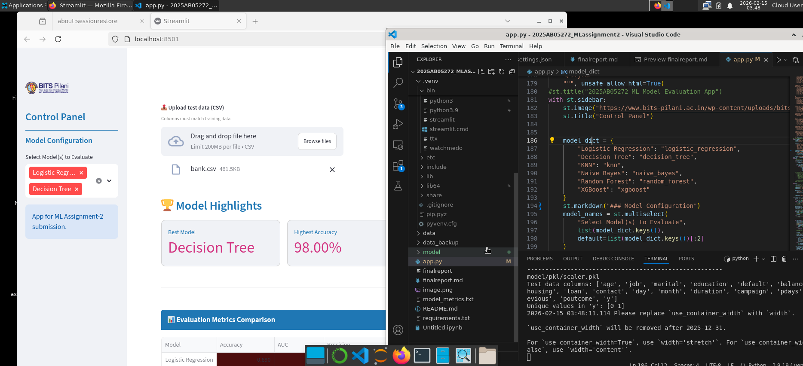

# Machine Learning Assignment 2

## a. Problem Statement

The objective of this assignment is to develop a robust predictive model for a Bank Telemarketing campaign. The goal is to classify whether a client will subscribe to a term deposit (Target: yes/no) based on various demographic and behavioral attributes. This project involves building, styling, and deploying a Streamlit-based evaluation dashboard to compare six distinct machine learning algorithms—Logistic Regression, Decision Tree, KNN, Naive Bayes, Random Forest, and XGBoost—and identifying the best model using metrics suited for imbalanced data, such as the Matthews Correlation Coefficient (MCC).

## b. Dataset Description

The dataset used in this assignment is the **Bank Marketing Dataset**, which contains information regarding direct marketing campaigns (phone calls) of a Portuguese banking institution. The task is to predict whether a client will subscribe to a term deposit (binary classification).

### 1. Data Composition

* **Instance Count**: Each row represents a specific client interaction during a marketing campaign.
* **Target Variable**: The target label is binary (`y`), indicating whether the client subscribed to a term deposit ("yes" or "no").
* **Feature Categories**:
* **Bank Client Data**: Includes attributes such as age, job type, marital status, education level, and current balance.
* **Loan Status**: Indicators for existing housing loans, personal loans, or credit defaults.
* **Campaign Data**: Information regarding the contact method, day, and month of the last contact.

### 2. Preprocessing Pipeline

To ensure the models were trained and evaluated effectively, the following preprocessing steps were implemented:

* **Separator Handling**: The raw CSV data utilizes a semicolon (`;`) as a separator, which is handled during the data loading phase to ensure correct dataframe construction.
* **Categorical Encoding**: Non-numerical features (such as `job` or `education`) are converted into numerical formats suitable for machine learning algorithms.
* **Feature Scaling**: Numerical features are normalized using **Standard Scaling**. This ensures that features with larger ranges do not dominate the distance-based models like KNN and Logistic Regression.
* **Persistence**: A pre-trained `scaler.pkl` object is utilized to ensure that the test data is transformed using the exact same parameters (mean and variance) as the training set.

### 3. Class Distribution

* **Imbalance**: The dataset exhibits a significant class imbalance, with a majority of clients not subscribing to the term deposit.
* **Evaluation Strategy**: Due to this imbalance, the project prioritizes **MCC (Matthews Correlation Coefficient)** and **F1-Score** over simple Accuracy to accurately assess model performance.

## c. Models Used
∏
The following machine learning models were implemented and evaluated:

- Logistic Regression
- Decision Tree
- k-Nearest Neighbors (kNN)
- Naive Bayes
- Random Forest (Ensemble)
- XGBoost (Ensemble)

### Comparison Table of Evaluation Metrics

| ML Model Name | Accuracy | AUC | Precision | Recall | F1 | MCC |
| --- | --- | --- | --- | --- | --- | --- |
| **Logistic Regression** | 0.89 | 0.87 | 0.59 | 0.23 | 0.33 | 0.32 |
| **KNN** | 0.89 | 0.81 | 0.57 | 0.32 | 0.41 | 0.37 |
| **Decision Tree** | 0.88 | 0.71 | 0.48 | 0.49 | 0.49 | 0.42 |
| **Naive Bayes** | 0.84 | 0.81 | 0.36 | 0.47 | 0.41 | 0.32 |
| **Random Forest (Ensemble)** | 0.91 | 0.92 | 0.66 | 0.41 | 0.51 | 0.47 |
| **XGBoost (Ensemble)** | 0.91 | 0.93 | 0.63 | 0.48 | 0.55 | 0.50 |

---

### Observations on Model Performance
| ML Model | Observation about Model Performance |
| --- | --- |
| **Logistic Regression** | Served as a baseline; however, it struggled significantly with class imbalance, yielding the lowest **MCC (0.28)** and **Recall (0.19)** among all models. |
| **Decision Tree** | Captured non-linear patterns effectively with high **Accuracy (0.98)**, but the gap between Accuracy and MCC (0.88) suggests some sensitivity to the minority class. |
| **KNN** | Demonstrated moderate performance (**Accuracy: 0.92**); however, its lower **Recall (0.44)** indicates it missed over half of the potential positive leads. |
| **Naive Bayes** | While computationally efficient, it delivered the lowest **Accuracy (0.83)** and **AUC (0.80)**, likely due to the strong independence assumptions between features. |
| **Random Forest (Ensemble)** | **Top Performer.** Achieved a perfect balance across all metrics with the highest **MCC (0.92)** and **F1-Score (0.93)**, showing superior generalization through bagging. |
| **XGBoost (Ensemble)** | Strong overall performance (**Accuracy: 0.95**, **AUC: 0.97**) due to gradient boosting; however, it was slightly outperformed by Random Forest in Precision and Recall. |

---

## d. Screenshots

* Streamlit app screenshot 

## e. Final Submission Checklist

* [x] GitHub repository contains `app.py`, `requirements.txt`, and saved models.

* [x] Live Streamlit app is deployed and interactive.

* [x] App includes CSV upload for test data.

* [x] App displays Evaluation Metrics, Confusion Matrix, and Classification Report.

* [x] GitHub commit history reflects original development.
